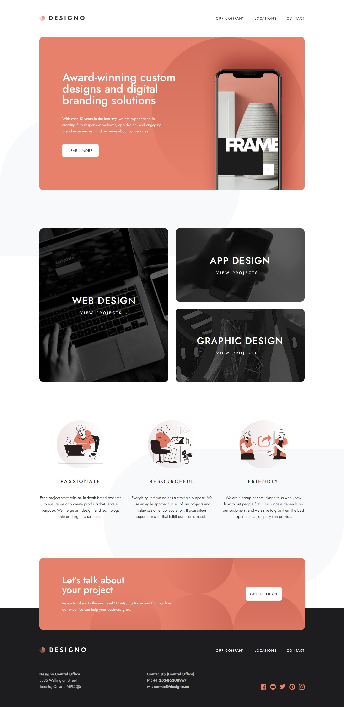

- Deploy [click here](https://signo-website-adrianoescarabote.vercel.app/)

# Frontend Mentor - Designo agency website solution

This is a solution to the [Designo agency website challenge on Frontend Mentor](https://www.frontendmentor.io/challenges/designo-multipage-website-G48K6rfUT). Frontend Mentor challenges help you improve your coding skills by building realistic projects. 

## Table of contents

- [Overview](#overview)
  - [The challenge](#the-challenge)
  - [Screenshot](#screenshot)
- [My process](#my-process)
  - [Built with](#built-with)
  - [Continued development](#continued-development)
- [Author](#author)

## Overview

### The challenge

Users should be able to:

- View the optimal layout for each page depending on their device's screen size
- See hover states for all interactive elements throughout the site
- Receive an error message when the contact form is submitted if:
  - The `Name`, `Email Address` or `Your Message` fields are empty should show "Can't be empty"
  - The `Email Address` is not formatted correctly should show "Please use a valid email address"
- **Bonus**: View actual locations on the locations page maps

### Screenshot

## My process

### Built with

- Semantic HTML5 markup
- CSS custom properties
- Flexbox
- CSS Grid
- [vue-spinner](https://www.npmjs.com/package/vue-spinner) - Pre-load
- [Storybook](https://storybook.js.org/) - to document the components
- [Vue.js](https://vuejs.org/) - JS framework
- [Vue Router](https://router.vuejs.org/) - to build single page applications with Vue

### Continued development

I am very pleased with the outcome of my second Vue project! I have learned a lot and I believe it was a valuable experience to complete this project. Some of the skills I acquired include:

- Developing a single-page application with Vue using Vue-Router.
- Documenting components with Storybook.

As for Storybook, I plan to further improve my knowledge and dedicate more time to fully leverage this tool. In summary, I am thrilled to have completed this project and to have gained more knowledge about Vue.

## Author

- Linkedin - [AdrianoEscarabote](https://www.linkedin.com/in/adriano-escarabote-944b02233/)
- Frontend Mentor - [@AdrianoEscarabote](https://www.frontendmentor.io/profile/AdrianoEscarabote)
- Instagram - [@ogdrian](https://www.instagram.com/ogdrian/)
- Twitter - [@drianEscarabote](https://twitter.com/drianEscarabote)